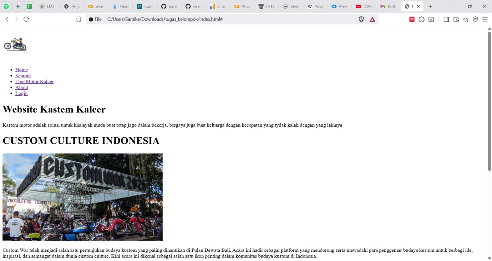

**LAPORAN PRAKTIKUM**

**PEMBUATAN WEBSITE DENGAN MENGGUNAKAN HTML SEMANTIC LAYOUT**

**Dosen Pengampu: Ir. Gede Humaswara Prathama, S.T., M.T.**

{width="2.9583333333333335in"
height="2.9583333333333335in"}

Oleh:

  -----------------------------------------------------------------------
  Kadek Wahyu Santika Putra                              \(42430012\)
  -----------------------------------------------------------------------
  I Nyoman Theo Ardiles Rada                             \(42430018\)
  -----------------------------------------------------------------------
  Gede Sathya Pratama Deva                               \(42430056\)
  -----------------------------------------------------------------------

**UNIVERSITAS PENDIDIKAN NASIONAL**

**FAKULTAS TEKNIK DAN INFORMATIKA**

**PROGRAM STUDI TEKNOLOGI INFORMASI**

**2025**

1.  Tujuan

```{=html}
<!-- -->
```
a.  Mampu membuat struktur halaman web dengan menggunakan HTML dan HTML
    Semantik

b.  Mampu menerapkan elemen dari HTML dan HTML Semantik

c.  Membuat halaman website yang rapi, mudah digunakan, dan terstruktur

```{=html}
<!-- -->
```
2.  Pendahuluan

Perkembangan teknologi informasi saat ini telah mendorong munculnya
berbagai media digital sebagai sarana komunikasi, promosi, dan
penyampaian informasi. Salah satunya adalah website, yang berfungsi
tidak hanya sebagai media informasi tetapi juga sebagai wadah untuk
mengekspresikan ide, minat, serta budaya tertentu.

Website kalcersite hadir dengan tema *custom culture motorcyle*, yaitu
budaya modifikasi dan gaya hidup penggemar sepeda motor kustom. Tema ini
dipilih karena dunia *custom motorcycle* memiliki daya tarik tersendiri,
baik dari segi seni, kreativitas, maupun komunitas yang terus
berkembang. Melalui website ini, informasi mengenai budaya motor kustom
dapat disajikan secara menarik, mudah diakses, dan memberikan pengalaman
berbeda bagi para pengunjung.

Pembuatan website ini bertujuan untuk menghadirkan media yang informatif
dan interaktif, sekaligus menjadi sarana apresiasi terhadap kreativitas
di bidang otomotif khususnya *custom motorcycle*. Selain itu, laporan
ini disusun untuk mendokumentasikan proses perencangan dan pembuatan
website Kalcersite, mulai dari perencanaan, desain, implementasi, hingga
evaluasi.

3.  Pembahasan

**Penjelasan kode**

index.html

{width="6.268055555555556in"
height="2.3381944444444445in"}

1.  **\<!DOCTYPE html\>**\
    Memberitahu browser kalau dokumen ini adalah **HTML5**.\
    ➝ Supaya browser membaca kode sesuai aturan HTML5, bukan versi lama.

2.  **\<html lang=\"en\"\>**\
    Tag utama pembungkus semua isi website.\
    ➝ Atribut lang=\"en\" berarti bahasa utama halaman ini adalah
    **English**, ini penting untuk SEO dan pembaca layar.

3.  **\<head\>**\
    Bagian kepala dokumen, berisi **informasi tentang website**, bukan
    isi yang ditampilkan langsung.\
    ➝ Contohnya judul, pengaturan teks, link CSS, meta data, dll.

4.  **\<meta charset=\"UTF-8\"\>**\
    Mengatur **tipe encoding karakter**.\
    ➝ UTF-8 memungkinkan website menampilkan hampir semua huruf
    (misalnya: huruf Latin, Arab, Jepang, dll).

5.  **\<meta name=\"viewport\" content=\"width=device-width,
    initial-scale=1.0\"\>**\
    Biar website bisa **responsive** di HP maupun komputer.\
    ➝ width=device-width = lebar halaman menyesuaikan layar device.\
    ➝ initial-scale=1.0 = zoom awal halaman normal (tidak
    diperbesar/diperkecil).

6.  **\<title\>kalcersite\</title\>**\
    Judul website yang tampil di **tab browser**.\
    ➝ Penting juga untuk SEO, karena judul ini yang dibaca mesin
    pencari.

7.  **\</head\>**\
    Penutup dari bagian \<head\>.

{width="6.268055555555556in" height="3.40625in"}

1.  **\<body\>**\
    Bagian utama website yang tampil di layar, semua konten web ditaruh
    di dalamnya.

2.  **\<!\--Bagian header\--\>**\
    Komentar, hanya untuk catatan programmer, tidak tampil di web.

3.  **\<header\>**\
    Bagian khusus di atas halaman web, biasanya berisi logo dan menu
    navigasi.

4.  **\<nav class=\"navbar\"\>**\
    Elemen navigasi untuk menampilkan menu.\
    class=\"navbar\" digunakan untuk mengatur tampilan dengan CSS.

5.  **\<div class=\"logoAtas\"\>**\
    Wadah (divisi) untuk menaruh logo website.\
    class=\"logoAtas\" dipakai untuk styling lewat CSS.

6.  **\<a href=\"#\"\>**\
    Link (anchor). href=\"#\" artinya link belum diarahkan ke halaman
    lain.

7.  **\**\
    Menampilkan gambar logo dari file foto/logo.png dengan lebar 80
    piksel.

8.  **\<ul\>**\
    Daftar tidak berurut (unordered list). Dipakai untuk menampilkan
    menu navigasi.

9.  **\<li\> \... \</li\>**\
    Item dalam daftar. Setiap menu diletakkan di dalam tag \<li\>.

10. **\<a href=\"index.html\"\>Home\</a\>**\
    Link menuju halaman index.html dengan teks \"Home\".

11. **\<a href=\"#\"\>Sejarah\</a\>**\
    Link kosong dengan teks \"Sejarah\".

12. **\<a href=\"#\"\>Tipe Motor Kalcer\</a\>**\
    Link kosong dengan teks \"Tipe Motor Kalcer\".

13. **\<a href=\"about.html\"\>About\</a\>**\
    Link menuju halaman about.html dengan teks \"About\".

14. **\<a href=\"#\"\>Login\</a\>**\
    Link kosong dengan teks \"Login\".

15. **\</ul\> \</nav\> \</header\>**\
    Menutup daftar, navigasi, dan bagian header.

{width="6.268055555555556in"
height="2.402083333333333in"}

1.  **\<!\--Bagian utama\--\>**\
    Komentar, hanya catatan untuk programmer, tidak muncul di halaman
    web.

2.  **\<main\>**\
    Bagian utama dari isi website.\
    Semua konten penting yang menjadi inti halaman biasanya diletakkan
    di sini.

3.  **\<section\>**\
    Bagian khusus di dalam halaman.\
    Dipakai untuk mengelompokkan konten yang memiliki topik sama.

4.  **\<h1\>Website Kastem Kalcer\</h1\>**\
    Judul utama halaman.\
    Biasanya hanya ada satu \<h1\> di tiap halaman.

5.  **\<p\>\...**\
    Paragraf teks.\
    Digunakan untuk menampilkan penjelasan atau isi konten.

6.  **\<h1\>CUSTOM CULTURE INDONESIA\</h1\>**\
    Judul besar kedua.\
    Bisa dipakai sebagai sub-judul utama bagian ini.

7.  **\**\
    Menampilkan gambar main.jpeg dari folder foto.\
    Gambar ditampilkan dengan lebar 500 piksel.

8.  **Paragraf-paragraf selanjutnya \<p\> \... \</p\>**\
    Menjelaskan detail tentang acara Custom War, isinya berupa teks
    panjang.\
    Setiap paragraf dibungkus dengan \<p\> agar rapi dan mudah dibaca.

9.  **\</section\>**\
    Menutup bagian konten yang dimulai dengan \<section\>.

10. **\</main\>**\
    Menutup bagian utama halaman.

{width="6.268055555555556in"
height="7.146527777777778in"}

1.  **\<!\--Bagian footer\--\>**\
    Komentar, hanya catatan untuk programmer, tidak tampil di halaman
    web.

2.  **\<footer\>**\
    Bagian kaki halaman web.\
    Biasanya berisi kontak, link tambahan, copyright, atau informasi
    singkat.

3.  **\<h4\>CONTACT US\</h4\>**\
    Judul kecil bagian kontak.

4.  **\<ul\>**\
    Daftar tidak berurut (unordered list).

5.  **\<li\>Phone: 123-123-123\</li\>**\
    Item daftar berisi nomor telepon.

6.  **\<li\>kastemkalcer@gmail.com\</li\>**\
    Item daftar berisi alamat email.

7.  **\<li\>Jln. Raya Kalcer 123\</li\>**\
    Item daftar berisi alamat.

8.  **\</ul\>**\
    Penutup daftar.

9.  **\<h4\>ABOUT US\</h4\>**\
    Judul kecil bagian \"About Us\".

10. **\<ul\>**\
    Daftar berisi link tambahan.

11. **\<li\>\<a href=\"#\"\>Our Story\</a\>\</li\>**\
    Item daftar dengan link bertuliskan \"Our Story\".

12. **\<li\>\<a href=\"#\"\>Our Team\</a\>\</li\>**\
    Item daftar dengan link bertuliskan \"Our Team\".

13. **\<li\>\<a href=\"#\"\>Our Blog\</a\>\</li\>**\
    Item daftar dengan link bertuliskan \"Our Blog\".

14. **\</ul\>**\
    Penutup daftar.

15. **\<h4\>ABOUT US\</h4\>**\
    Judul kecil lagi, seharusnya bisa diganti agar tidak duplikat
    (misalnya \"Legal Info\").

16. **\<ul\>**\
    Daftar berisi link aturan/legal.

17. **\<li\>\<a href=\"#\"\>Terms & Conditions\</a\>\</li\>**\
    Link ke halaman syarat dan ketentuan.

18. **\<li\>\<a href=\"#\"\>Privasi Policy\</a\>\</li\>**\
    Link ke halaman kebijakan privasi.

19. **\</ul\>**\
    Penutup daftar.

20. **\</footer\>**\
    Menutup bagian footer.

21. **\</body\>**\
    Menutup bagian utama isi halaman web.

22. **\</html\>**\
    Menutup dokumen HTML.

Struktur Folder

about.html

{width="6.268055555555556in"
height="2.9743055555555555in"}

1.  **\<!\--Bagian utama\--\>**\
    → Ini adalah **komentar** di HTML. Komentar hanya untuk catatan
    developer dan tidak tampil di halaman web.

2.  **\<main\>**\
    → Bagian utama dari isi web. Biasanya dipakai untuk konten inti yang
    paling penting di halaman.

3.  **\<section\>**\
    → Digunakan untuk membuat **bagian tertentu** dalam halaman. Di sini
    bagian yang dibuat adalah tentang **"About Us"**.

4.  **\<h1\>About Us\</h1\>**\
    → \<h1\> adalah judul utama dari section ini. Jadi judulnya adalah
    **"About Us"**.

5.  **\<p\> \... \</p\>**\
    → Digunakan untuk menuliskan paragraf teks.

Struktur folder

login.html

{width="6.268055555555556in"
height="3.2381944444444444in"}

1.  **\<!\--Bagian utama\--\>**\
    → Komentar, hanya catatan untuk developer, tidak ditampilkan di
    halaman web.

2.  **\<h1\>LOGIN\</h1\>**\
    → Judul utama halaman login.

3.  **\<form action=\"/login\" method=\"post\"\>**

-   \<form\> digunakan untuk membuat **form input data**.

-   action=\"/login\" → data yang diisi user akan dikirim ke URL
    > **/login**.

-   method=\"post\" → cara mengirim data ke server menggunakan metode
    > POST (lebih aman dibanding GET, karena data tidak tampil di URL).

4.  **\<label for=\"username\"\>Username:\</label\>**

-   \<label\> memberi **teks penjelasan** untuk input.

-   for=\"username\" → menghubungkan label dengan input yang memiliki
    > id=\"username\".

5.  **\<input type=\"text\" id=\"username\" name=\"username\"
    required\>**

-   \<input\> untuk membuat kotak isian.

-   type=\"text\" → isian berupa teks biasa.

-   id=\"username\" → pengenal unik input ini.

-   name=\"username\" → nama data yang akan dikirim ke server.

-   required → input wajib diisi, tidak bisa dikosongkan.

6.  **\<br\>**\
    → Membuat **baris baru** (enter). Digunakan supaya form lebih rapi.

7.  **\<label for=\"password\"\>Password:\</label\>**\
    → Sama seperti username, tapi ini untuk kolom password.

8.  **\<input type=\"password\" id=\"password\" name=\"password\"
    required\>**

-   type=\"password\" → input teks tapi ditampilkan sebagai bintang
    > (\*\*\*) agar lebih aman.

-   required → wajib diisi.

9.  **\<input type=\"submit\" value=\"Login\"\>**

-   Tombol untuk **mengirim form**.

-   value=\"Login\" → teks pada tombol adalah "Login".

10. **\</form\>**\
    → Penutup form.

```{=html}
<!-- -->
```
4.  Kode Hasil Program

{width="6.268055555555556in"
height="3.329861111111111in"}.jpg){width="6.268055555555556in"
height="3.329861111111111in"}

{width="6.268055555555556in"
height="3.329861111111111in"}

.jpg){width="6.268055555555556in"
height="3.329861111111111in"}

{width="6.268055555555556in"
height="3.329861111111111in"}
